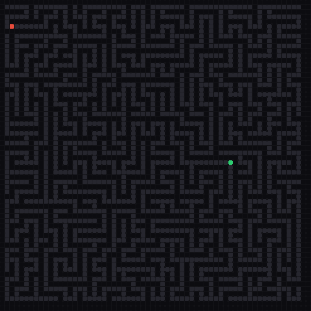
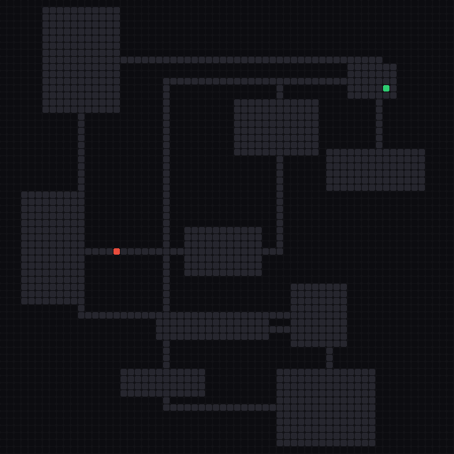
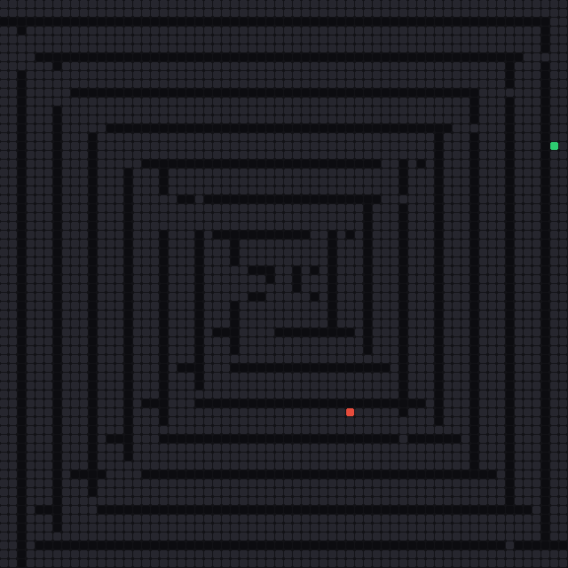

# Hierarchical Learned Pathfinding (HLP)

Shortest-path search on 2D obstacle grids, accelerated by a neural network that
learns to throw away most of the map before the actual search begins.

<p align="center">
  
  
  
</p>
<p align="center"><em>Corridor prediction on DFS Maze, Rooms & Corridors, and Spiral maps. The network progressively narrows down quadtree blocks (purple → green) until only a thin corridor remains, then finds the shortest path (blue) inside it.</em></p>

## How it works

Classical pathfinding (A\*, BFS, Dijkstra) touches every reachable cell.
On a 512×512 grid that can mean visiting hundreds of thousands of cells, most of
which are nowhere near the optimal path.

HLP sidesteps this by asking a small CNN — **QuadTreeConvNet** — to predict a
*corridor*: a narrow subset of the grid that is very likely to contain the
shortest path. Search then runs only inside that corridor.

### Quadtree decomposition

The grid is recursively split into quadrants, forming a tree of blocks from the
full map down to individual cells. At each level the corresponding block is
downsampled into a fixed 8×8 obstacle density map, so the network always sees
the same input resolution regardless of how large the grid is.

### Corridor prediction

Starting from the root (the entire grid), QuadTreeConvNet decides which of the
four child quadrants the shortest path passes through. Quadrants that are
predicted to be irrelevant are pruned. Accepted quadrants are subdivided and
evaluated again at the next level. This continues level by level until the
blocks are small enough (single cells for *Neural Only*, or 16×16 blocks for
*Hybrid*). All blocks at the same level are batched into a single forward pass,
so inference is fast.

The result is a corridor that typically covers only 8–15 % of the grid but still
contains the optimal path.

### Inference modes

| Mode | How it works | Optimal? |
|---|---|---|
| **Neural Only** | Predict corridor down to cell level, BFS inside corridor | No (but usually optimal in practice) |
| **Hybrid** | Predict corridor down to block level, algebraic transfer-matrix verification inside corridor blocks | Yes (guaranteed) |
| **Matrix Only** | Full algebraic computation, no neural model | Yes (guaranteed) |

### Mixture of Experts

Instead of a single model for all grid layouts, HLP trains independent
specialist networks — one per map type. At inference time the appropriate
specialist is selected based on the map type. This lets each model focus on the
obstacle patterns it will actually encounter.

Supported map types: **Random Scatter**, **DFS Maze**, **Spiral**,
**Recursive Division**, **Rooms & Corridors**.

## Setup

The project uses [uv](https://docs.astral.sh/uv/) for dependency management.

```bash
# Install uv (if not already installed)
curl -LsSf https://astral.sh/uv/install.sh | sh

# Clone and enter the repo
git clone <repo-url>
cd hierarchical-learned-pathfinding

# Create a virtual environment and install dependencies
uv venv
source .venv/bin/activate
uv pip install -e .
```

For GPU-accelerated training, install the appropriate PyTorch build for your
CUDA version. For example:

```bash
uv pip install torch --index-url https://download.pytorch.org/whl/cu121
```

## Training

Training uses a two-phase pipeline:

1. **Phase 1 — Teacher forcing**: The model learns from pre-extracted
   per-node examples (8×8 obstacle maps + source/goal positions + ground-truth
   quadrant activations).
2. **Phase 2 — Adversarial mining**: Full recursive inference is run on new
   grids, failures are collected, and the model is fine-tuned on the hard
   examples.

### Train a single specialist

```bash
python -m hlp.neural.train --map-type random_scatter
```

Replace `random_scatter` with any of: `dfs_maze`, `spiral`,
`recursive_division`, `rooms`.

### Train all specialists sequentially

```bash
python -m hlp.neural.train --all
```

This trains one specialist per map type and saves checkpoints to
`checkpoints/best_<map_type>.pt`.

### Training options

| Flag | Default | Description |
|---|---|---|
| `--config PATH` | `configs/default.yaml` | Path to YAML config file |
| `--map-type TYPE` | — | Train a specialist for one map type |
| `--all` | — | Train specialists for all map types |

Training hyperparameters (epochs, learning rate, adversarial rounds, etc.) are
set in `configs/default.yaml` or `hlp/config.py`.

## Benchmarking

```bash
# Benchmark all map types with all available specialist models
python scripts/benchmark.py

# Benchmark a single map type
python scripts/benchmark.py --map-type dfs_maze

# Include slower classical baselines (BFS, Dijkstra, Matrix Only)
python scripts/benchmark.py --all
```

### Benchmark options

| Flag | Default | Description |
|---|---|---|
| `--config PATH` | `configs/default.yaml` | Config file |
| `--grid-sizes N [N ...]` | `32 64 128 256 512` | Grid sizes to test |
| `--trials N` | `10` | Trials per size |
| `--output PATH` | `results/benchmark.csv` | Output CSV path |
| `--density FLOAT` | `0.2` | Obstacle density |
| `--map-type TYPE` | all | Restrict to one map type |
| `--all` | — | Include BFS, Dijkstra, Matrix Only |

Results are printed to the terminal and saved to CSV.

## Interactive UI

A Pygame-based visualizer lets you generate maps, run any pathfinding method,
and see the predicted corridor overlaid on the grid.

```bash
python scripts/run_ui.py
```

Features:
- Grid sizes: 32, 64, 128, 256
- All five map types with a one-click **Generate** button
- Methods: Matrix Only, Neural Only, Hybrid, A\*, Dijkstra
- Click-to-edit obstacles, S/G keys to place start and goal
- Animated path and corridor visualization

## Project structure

```
hlp/
  config.py             Configuration dataclasses + YAML I/O
  grid.py               Grid representation and BFS utilities
  decomposition.py      Quadtree block hierarchy
  composition.py        Transfer matrix computation
  extraction.py         Path reconstruction from transfer matrices
  tropical.py           Tropical semiring operations
  pipeline.py           Unified inference (matrix_only / neural_only / hybrid)
  neural/
    model.py            QuadTreeConvNet architecture + recursive inference
    dataset.py          Training data generation
    train.py            Two-phase training loop
    losses.py           Weighted BCE loss

ui/
  app.py                Pygame application
  map_generators.py     Five map-type generators
  grid_view.py          Grid rendering
  components.py         UI widgets (buttons, dropdowns)
  theme.py              Colors and styling

scripts/
  run_ui.py             Launch the UI
  benchmark.py          Benchmarking script
  train.py              Training CLI wrapper

baselines/
  astar.py              A* implementation
  dijkstra.py           Dijkstra implementation

configs/
  default.yaml          Default hyperparameters

checkpoints/            Trained model weights (*.pt)
```

## Configuration

All hyperparameters live in `configs/default.yaml`:

```yaml
grid:
  height: 256
  width: 256
  obstacle_density: 0.2

block:
  block_size: 16

neural:
  d: 64
  max_levels: 12
  grid_resolution: 8
  checkpoint_path: checkpoints/best.pt

train:
  num_train: 50000
  num_val: 5000
  batch_size: 64
  teacher_epochs: 30
  adversarial_rounds: 5
  adversarial_queries: 10000
  pos_weight: 5.0
  early_stop_patience: 5

inference:
  mode: hybrid
  activation_threshold: 0.3
```

## License

This project is for research purposes.
